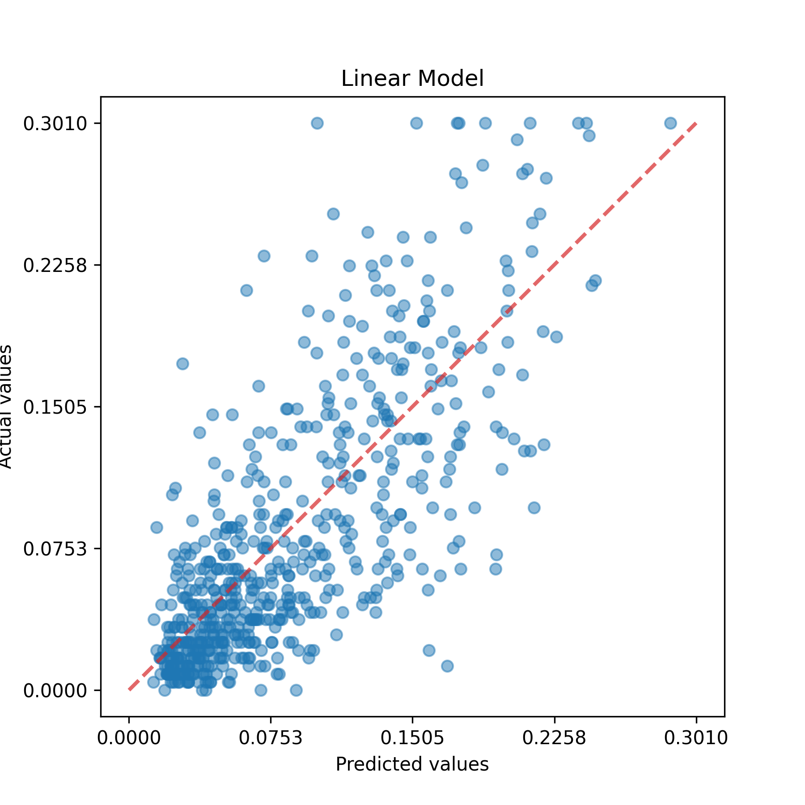
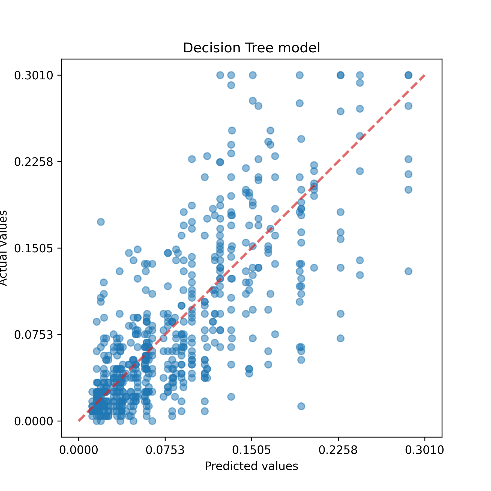
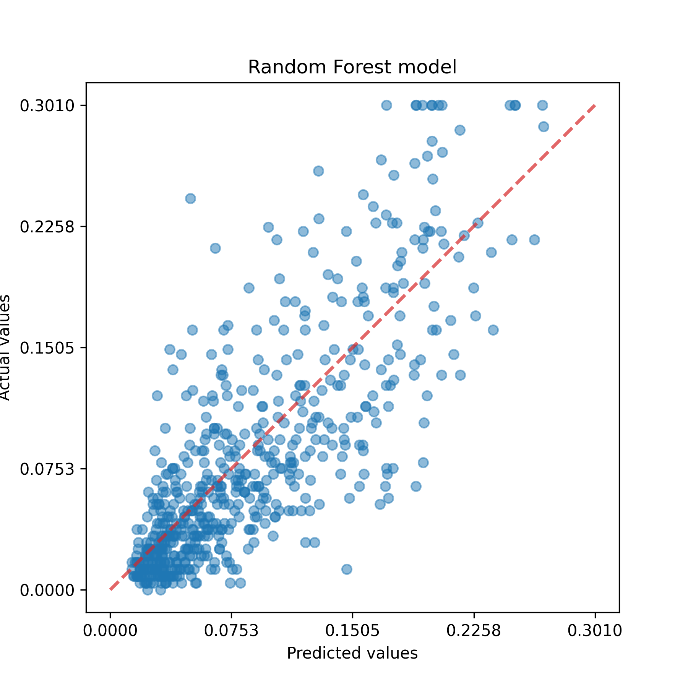

# Proyecto-Crystal-TEC

## Descripción
El proyecto fu enfocado en el análisis y modelado de datos sobre parámetros socioeconomicos de 1990 provenientes de censos de USA e información criminal dada por el FBI en 1995. La fuente de estos datos se localiza en el repositorio de _Machine Learning_ del _Center for Machine Learning and Intelligent Systems_ de la Universidad de California.

## Información de los datos
El conjunto de datos se encuentra bajo el nombre _Communities and Crime Data_ bajo la etiqueta _Social_ y posee las siguientes carácteristicas:

- Los datos son multivariados y reales
- Se cuenta con 1994 instancias, que representa en total de comunidades en el estudio, y 128 atributos para describir cada instancia.
- Habrá instancias con atributos no disponibles.
- Todos los atributos numéricos fueron transformados a una escala entre 0 y 1.

## Objetivo
El último atributo de nombre _ViolentCrimesPerPop_ representa el número total de crímenes violentos por cada 100,000 habitantes y es el atributo objetivo por predecir mediante regresión.

## Modelado
Se utilizaron tres modelos diferentes para predecir la variable objetivo con muestras de entrenamiento y prueba del 70% y 30%:

- Regresión lineal
- Decision Tree
- Random Forest

Para el modelo lineal se consideraron todos los coeficientes para cada variables como positivos y constante nula para evitar predicciones con valor negativo. Para el resto de modelos se ajustaron los hiper parámetros con el fin de hallar la configuración óptima que maximize la constante R2.

## Resultados
Los resultados para cada modelo se reflejan en los gráficos de valores reales contra predichos para la variable objetivo con cada modelo.

| Modelo | MS2 | MA | R2 |
| --- | --- | --- | --- |
| Lineal | 0.0460 | 0.0347 | 0.5723 |
| Decision Tree | 0.0479 | 0.0345 | 0.5373 |
| Random Forest | 0.0428 | 0.0317 | 0.6395 |

